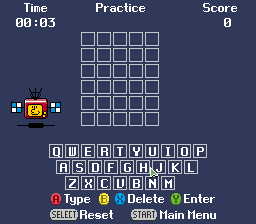
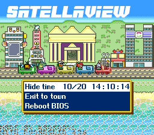

# sfc-bs-converter

A CLI tool to convert SNES/SFC games into Satellaview (BS) games.

This modifies the header of the game and updates the checksum.

I made this tool to easily convert the games I made for the Satellaview with [pvsneslib](https://github.com/alekmaul/pvsneslib).

It may or may not work with other roms as changing the header does not guarantee that the game will run properly.





### Differences between headers

| SNES rom header                                                                                                                                                                                                                                                                                                                                 | BS rom header                                                                                                                                                                                                                                                                                                                                                                                                                                                                                                        |
|-------------------------------------------------------------------------------------------------------------------------------------------------------------------------------------------------------------------------------------------------------------------------------------------------------------------------------------------------|:---------------------------------------------------------------------------------------------------------------------------------------------------------------------------------------------------------------------------------------------------------------------------------------------------------------------------------------------------------------------------------------------------------------------------------------------------------------------------------------------------------------------|
| <br/><br/><br/>xFC0 = Cartridge title (21 bytes)<br/><br/>xFD5 = ROM speed and memory map mode<br/>xFD6 = Chipset<br/>xFD7 = ROM size<br/>xFD8 = RAM size<br/>xFD9 = Country (Implies NTSC/PAL)<br/>xFDA = Developer ID<br/>xFDB = ROM version (0 = first)<br/>xFDC = Checksum complement<br/>xFDE = Checksum<br/>xFE0 = Interrupt vectors<br/> | xFB0-xFB1 = Licensee / Maker Code<br/>xFB2-xFB5 = Program Type<br/>xFB6-xFBF = Reserved<br/>xFC0-xFCF = Title (Shift-JIS)<br/>xFD0-xFD3 = Block Allocation Flags<br/>xFD4-xFD5 = Limited Starts<br/>xFD6      = Date - Month<br/>xFD7      = Date - Day<br/>xFD8      = ROM Speed (unconfirmed) & Map Mode<br/>xFD9      = File/Execution Type<br/>xFDA      = Fixed (0x33)<br/>xFDB      = Version Number (unconfirmed)<br/>xFDC-xFDD = Inverse Checksum<br/>xFDE-xFDF = Checksum<br/>xFE0-xFFF = Interrupt Vectors |

<p>Sources:

[SNES ROM Header](https://snes.nesdev.org/wiki/ROM_header)

[BS-X Satellaview Header](https://wiki.superfamicom.org/bs-x-satellaview-header)

</p>

### Execution

In a Windows terminal:

```
D:\emulation\git\sfc-bs-converter\release>sfc-bs-converter.exe
SFC to BS Converter 1.0
No input rom. Use option -help for more info.
```

or for the jar (requires JRE)

```
D:\emulation\git\sfc-bs-converter\release>java -jar sfc-bs-converter-1.0.jar
SFC to BS Converter 1.0
No input rom. Use option -help for more info.
```

### Convert SFC to BS

```
sfc-bs-converter.exe [options] -i <file> -o <file>
```

| Argument    | Description |
|-------------|-------------|
| -i \<file\> | input file  |
| -o \<file\> | output file |

| Option                      | Description                                                                                             |
|-----------------------------|---------------------------------------------------------------------------------------------------------|
| -h                          | Display help                                                                                            |
| -lorom<br/>-hirom<br/>-auto | If input rom is LoRom<br/>If input rom is HiRom<br/>autodetection (experimental)                        |
| -d \<int\>                  | The broadcast day of the month (1..31)                                                                  |
| -m \<int\>                  | The broadcast month (1..12)                                                                             |
| -t \<string\>               | The title of the game in ASCII (max 16 characters)<br/>Use quotation marks if the title contains spaces |
| -b \<int\> \<int\>          | Overrides a given byte in the header (see details below)                                                |

Examples
```posh
D:\emulation\git\sfc-bs-converter>release\sfc-bs-converter-1.0.exe -b 29 80 -i "tmp\bs-demo-mpack.sfc" -o "tmp\bs-demo-mpack.bs"
SFC to BS Converter 1.0
---------- Input Header ----------
Title: BS-DEMO-MPACK
Rom Speed: SlowRom (20)
Map Mode: LoROM (20)
---------- ------------ ----------
---------- Output Header ----------
Title: BS-DEMO-MPACK
Blocks: 2 (00000011)
Boot Limit: Unlimited (00)
Month: 1 (10)
Day: 1 (08)
Rom Speed: SlowRom (20)
Map Mode: LoROM (20)
Soundlink Radio: Unmuted (80)
Execution: FLASH (80)
St.GIGA Intro: Skip (80)
---------- ------------- ----------
Saving rom: tmp\bs-demo-mpack.bs
```

#### Override option _-b_

The option `-b <int> <int>` lets you override any given byte in the BS header
(after all other options have been applied and before checksum is updated).<br/>
1st parameter: the offset from the start of the header (00..4F)<br/>
2nd parameter: the value (00..FF)<br/>
Both values must be in hexadecimal (no prefix)<br/>
Can be used multiple times
Reminder that the BS header will start at 7FB0 or FFB0.

Example:
-b 28 31
will change ROM Speed & Map mode (7FD8/FFD8) to FastROM HiROM (31)

Here are some possible offsets for this option:

| Offset | Section                             |
|--------|-------------------------------------|
| 00     | xFB0-xFB1 = Licensee / Maker Code   |
| 02     | xFB2-xFB5 = Program Type            |
| 06     | xFB6-xFBF = Reserved                |
| 10     | xFC0-xFCF = Title (Shift-JIS)       |
| 20     | xFD0-xFD3 = Block Allocation Flags  |
| 24     | xFD4-xFD5 = Limited Starts          |
| 26     | xFD6 = Date - Month                 |
| 27     | xFD7 = Date - Day                   |
| 28     | xFD8 = ROM Speed & Map Mode         |
| 29     | xFD9 = File/Execution Type          |
| 2A     | xFDA = Fixed (0x33)                 |
| 2B     | xFDB = Version Number (unconfirmed) |
| 2C     | xFDC-xFDD = Inverse Checksum        |
| 2E     | xFDE-xFDF = Checksum                |
| 30     | xFE0-xFFF = Interrupt Vectors       |

### Display header

```
sfc-bs-converter.exe [option] [mode] <file>
```

| Mode               | Description               |
|--------------------|---------------------------|
| -info-sfc \<file\> | prints out the SFC header |
| -info-bs \<file\>  | prints out all BS headers |


| Option      | Description                                                                                             |
|-------------|---------------------------------------------------------------------------------------------------------|
| -o \<file\> | Writes the output to a text file with SHIFT-JIS encoding. (useful if your terminal only supports UTF-8) |

Examples
```posh
D:\emulation\git\sfc-bs-converter\release>sfc-bs-converter.exe -info-sfc bs-demo-mpack.sfc
SFC to BS Converter 1.0
SFC Header found at offset 07FC0
Title: BS-DEMO-MPACK
Rom Speed: SlowRom (20)
Map Mode: LoROM (20)
```

```posh
D:\emulation\git\sfc-bs-converter\release>sfc-bs-converter.exe -o output.txt -info-bs "Tamori no Picross (9-6) + Wai Wai Check (8-26).bs"
----- BS header found (offset 0FFB0) -----
Title:  ﾀﾓﾘのﾋﾟｸﾛｽ 5/10
Blocks: 4 (11100001)
Boot Limit: Unlimited (00)
Month: 9 (90)
Day: 6 (33)
Rom Speed: SlowRom (21)
Map Mode: HiROM (21)
Soundlink Radio: Unmuted (20)
Execution: PSRAM (20)
St.GIGA Intro: Play (20)
----- ------------------------------ -----
----- BS header found (offset 27FB0) -----
Title: ﾜｲﾜｲ8/26版本放送
Blocks: 4 (00011110)
Boot Limit: Unlimited (00)
Month: 8 (80)
Day: 26 (D2)
Rom Speed: SlowRom (20)
Map Mode: LoROM (20)
Soundlink Radio: Unmuted (20)
Execution: PSRAM (20)
St.GIGA Intro: Play (20)
----- ------------------------------ -----

```

### Compile the tool

This a Maven project in Java.

```
mvn clean
mvn package
```

`mvn package` will create two files in the release folder:

```
release/sfc-bs-converter.exe
release/sfc-bs-converter.jar
```

The exe file is a wrapper ([source](https://github.com/dgiagio/warp)) for Windows (more info: [How to create a standalone .exe in Java](https://stackoverflow.com/questions/69811401/how-to-create-a-standalone-exe-in-java-that-runs-without-an-installer-and-a-jr)) which lets you run the jar without a JRE.

If you want to build the executable for another OS, you should be able to modify the package goal in the pom.xml. 
